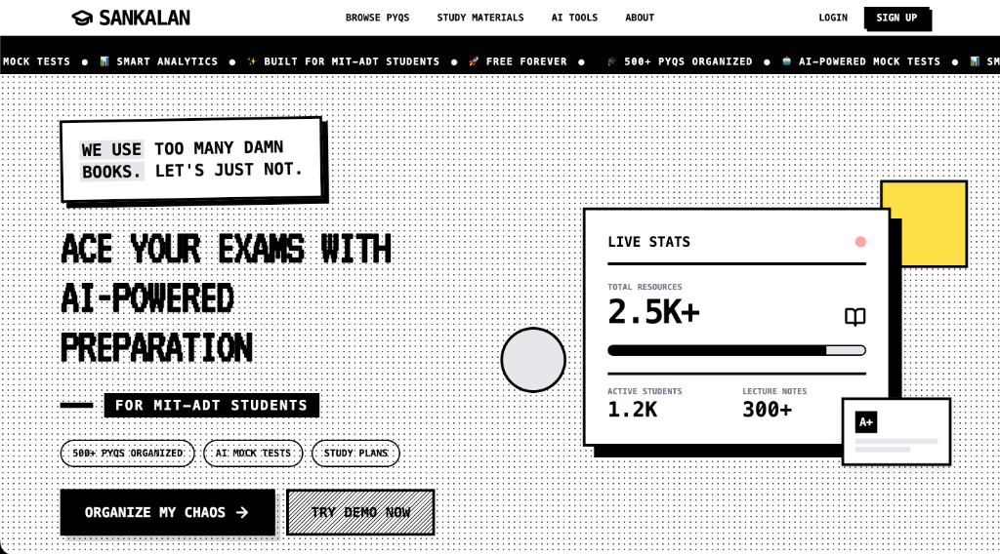

<div align="center">
  
  
  
</div>

<br />

<div align="center">
  <h1 style="font-size: 3rem; font-weight: 900; letter-spacing: -2px;">SANKALAN</h1>
  <p style="font-size: 1.2rem; font-weight: 500; color: #666;">THE STUDENT OPERATING SYSTEM</p>
  <br />
  
</div>

<br />

## ⚡ Overview

**Sankalan** is not just a study platform; it's a **Mission Control Center** for academic excellence. Built exclusively for **MIT-ADT University** students, it replaces fragmented resources with a unified, high-performance "Student OS".

Designed with a distinctive **Neo-Brutalist** aesthetic, Sankalan creates a high-energy, tactical environment that turns mundane study tasks into engaging missions. From organizing chaos to analyzing performance, everything happens here.

---

## 🚀 Key Modules

### 📚 **Central Database (PYQs & Materials)**
No more begging seniors for messy PDFs.
- **500+ Organized Resources**: Previous Year Questions (PYQs) and Lecture Notes indexed by Branch, Year, and Semester.
- **Smart Filtering**: Instant access via tactical filters.
- **Preview & Download**: Integrated high-speed PDF viewer with direct downloads.

### 🧠 **AI Power Tools**
Supercharge your prep with Gemini-powered utilities.
- **Mock Assassin**: Generate custom quizzes from *any* topic or PDF upload.
- **Resume Architectural**: Build ATS-friendly resumes with the "Jake Ryan" LaTeX template.
- **Note Summarizer**: Turn 50-page lectures into 5-minute tactical briefings.

### 🎯 **Study Rooms (Focus Protocol)**
Coordinate your study sessions.
- **Live Sync**: Join public or private rooms with real-time status.
- **Pomodoro Integration**: Built-in timers for Work/Break cycles.
- **Announcement System**: Broadcast messages to your squad.

### 📊 **Admin Command [V3]**
A professional-grade console for managing the ecosystem.
- **Dashboard**: Real-time traffic and usage analytics (Vercel Integration).
- **Content Ops**: Bulk upload & manage PYQs via the "Monochrome" tactical interface.
- **User Directory**: Role-based access control and student monitoring.

---

## 🛠️ Tech Stack

Built for speed, scale, and performance.

| Component | Technology | Description |
| :--- | :--- | :--- |
| **Frontend** |  | Core UI Library (Vite Powered) |
| **Styling** |  | Utility-first styling engine |
| **Auth** |  | Secure, session-less authentication |
| **Database** |  | Real-time Firestore NoSQL DB |
| **AI Engine** |  | Generative Intelligence |
| **Deployment** |  | Edge Network Hosting |

---

## 💻 Installation & Setup

Initialize the operating system locally.

### Prerequisites
- Node.js > v18.0.0
- npm or yarn

### 1. Clone the Repo
```bash
git clone https://github.com/pranavgawaii/sankalan-platform.git
cd sankalan-platform
```

### 2. Install Dependencies
```bash
npm install
# or
yarn install
```

### 3. Configure Environment
Create a `.env.local` file in the root directory:
```env
VITE_CLERK_PUBLISHABLE_KEY=pk_test_...
VITE_FIREBASE_API_KEY=AIzaSy...
VITE_FIREBASE_AUTH_DOMAIN=...
VITE_FIREBASE_PROJECT_ID=...
# ... other Firebase config
```

### 4. Ignite Dev Server
```bash
npm run dev
```
Access the console at `http://localhost:5173`.

---

## 📂 Project Structure

```bash
sankalan/
├── assets/             # Global static assets (Hero images, etc.)
├── src/
│   ├── components/     # Atomic UI components
│   │   ├── admin/      # Admin Dashboard (Monochrome V3)
│   │   ├── ai/         # AI Tool Logic
│   │   └── ...
│   ├── context/        # React Context (Sound, Auth)
│   ├── hooks/          # Custom Hooks (useSound, useAuth)
│   ├── lib/            # Service Integrations (Firebase, utils)
│   └── App.tsx         # Main Router & Layout
├── public/             # Public assets
├── index.html          # Entry point (Metadata updated)
└── README.md           # You are here
```

---

## 🤝 Contributing

**Protocol:**
1.  Fork the repository.
2.  Create a feature branch (`git checkout -b feature/AmazingFeature`).
3.  Commit your changes (`git commit -m 'feat: Add AmazingFeature'`).
4.  Push to the branch (`git push origin feature/AmazingFeature`).
5.  Open a Pull Request.

---

<div align="center">
  <p>Built with 🖤 by <strong>Pranav Gawai</strong></p>
  
</div>
